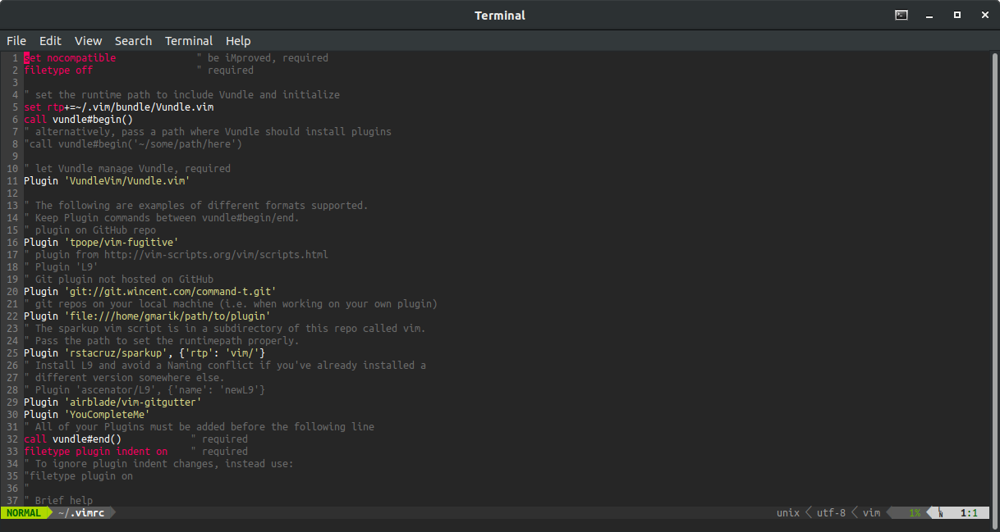
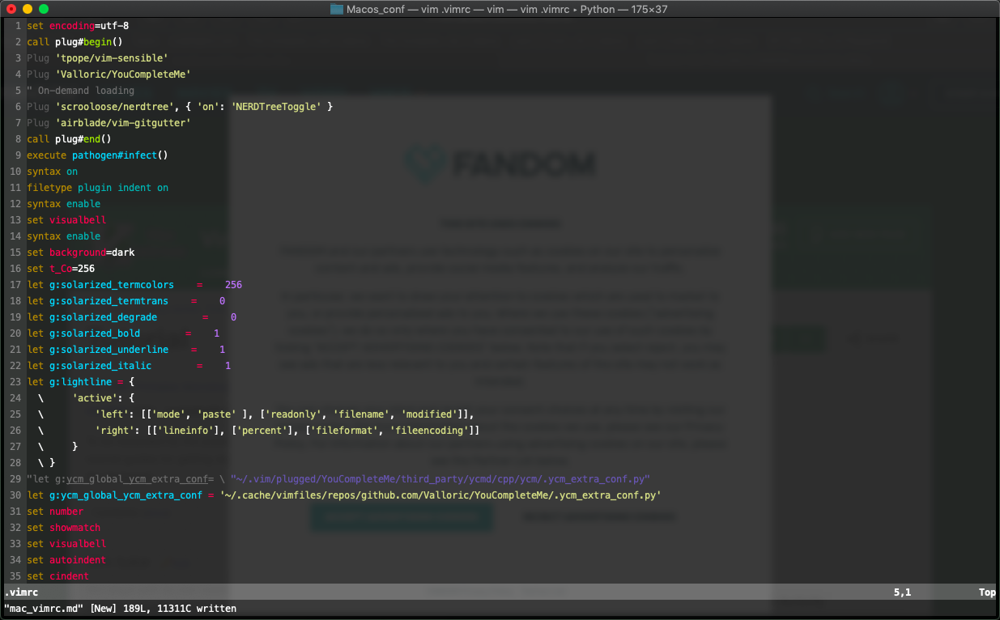

# Vim_config_files

### Vim configurations files to Linux and MacOS

For use this configuration files you need Vim and/or Tmux installed on your terminal.  

Also, you will need some packages installed on Vim or Terminal:

 - *Vundle* : https://github.com/VundleVim/Vundle.vim
 - *Oh My Zsh* : https://ohmyz.sh
 
 
 ____________________________
 
 1. Linux (Ubuntu)
 
 
 2. MacOS (Mojave)
 
 
